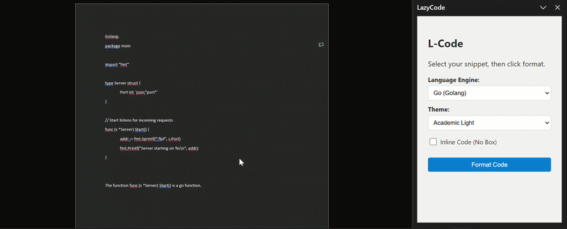

# L-Code 🚀

**Professional syntax highlighting for Microsoft Word**

L-Code is a lightweight developer tool that bridges the gap between IDEs and formal documentation. It leverages the **Prism.js** lexing engine to translate source code into native **Office Open XML (OOXML)**, providing IDE-grade syntax highlighting that Microsoft Word treats as **true native content** — no red spell-check squiggles, no broken indentation, and no layout corruption.

---

## 🎬 Demo



---

# 🎯 The Problem

Microsoft Word treats code as **plain text**, which creates several problems for developers and students writing reports.

* **Red Spellcheck Squiggles**
  Word constantly tries to "correct" variable names and programming keywords.

* **Collapsing Whitespace**
  Indentation and spacing are frequently lost or inconsistent.

* **Visual Noise**
  Copy-pasting from IDEs often introduces hidden HTML or formatting that breaks document layout.

* **Poor Readability**
  Code blocks lack syntax highlighting, making technical reports harder to read.

L-Code solves these problems by injecting **native OOXML syntax-highlighted code blocks directly into Word**.

---

# ✨ Features

### Native OOXML Injection

Generates raw **Microsoft Open XML** so code blocks behave like native Word elements.

### Multi-Language Support

Dedicated lexers for:

* `C++`
* `Go`
* `Python`
* `JavaScript`

### Theme Support

Choose the look that fits your document:

* `VS Code Dark+` – Ideal for digital documentation and screen viewing
* `Academic Light` – Optimized for printed lab reports (ink-friendly)

### Smart Inline Formatting

A custom **Ghost Mode** allows inline variables within sentences without affecting line height or document flow.

Example:

> The variable `sensorValue` is used to compute the PID correction.

### Persistent Preferences

Language and theme preferences are saved automatically using `localStorage`.

---

# 🛠️ Tech Stack

**API**

* Office.js (Word JavaScript API)

**Engine**

* Headless Prism.js tokenizer

**Markup**

* Microsoft Flat OPC (OOXML)
* HTML5

**Persistence**

* Browser LocalStorage

---

# 🏗️ Architecture Overview

```
User Code Input
      │
      ▼
 Prism.js Tokenizer
      │
      ▼
 Syntax Token Stream
      │
      ▼
 OOXML Generator
      │
      ▼
 Native Word Document Content
```

Instead of inserting styled HTML, L-Code directly generates **Word's native XML structure**, ensuring stability and compatibility with Word's rendering engine.

---

# 🚀 Installation & Local Development

## 1️⃣ Clone the Repository

```bash
git clone https://github.com/Ghunter254/L-Code.git
cd L-Code
npm init -y
```

---

## 2️⃣ Install Office Add-in Development Certificates

```powershell
npx office-addin-dev-certs install
```

This installs trusted certificates required for secure local Office add-in development.

---

## 3️⃣ Start the Secure Local Server

```powershell
npx http-server -p 3000 --ssl --cert "C:\Users\ypaul\.office-addin-dev-certs\localhost.crt" --key "C:\Users\ypaul\.office-addin-dev-certs\localhost.key" --cors
```

The Office add-in must be served over **HTTPS**.

---

## 4️⃣ Sideload the Add-in into Word

```powershell
npx office-addin-debugging start manifest.xml desktop
```

This launches Microsoft Word with the add-in loaded for development.

---

# 📦 Project Structure

```
L-Code
│
├── assets/
│   └── demo.gif
│
├── src/
│   ├── tokenizer/
│   ├── ooxml-generator/
│   └── ui/
│
├── manifest.xml
├── index.html
└── README.md
```

---

# 🎓 Ideal Use Cases

L-Code is particularly useful for:

* Engineering lab reports
* Computer science assignments
* Technical documentation
* Academic theses involving source code
* Research papers with algorithm listings

---

# 🛣️ Roadmap

Planned improvements:

* Additional language support
* Custom theme creation
* Export highlighted code as reusable Word styles
* Snippet templates
* Code block numbering
* Inline error highlighting

---

# 🤝 Contributing

Contributions are welcome!

1. Fork the repository
2. Create a feature branch
3. Commit your changes
4. Submit a pull request

---

# 📜 License

This project is licensed under the **MIT License**.

---

# ❤️ Acknowledgments

Powered by:

* Prism.js syntax highlighting engine
* Microsoft Office JavaScript API

---

**Developed with ❤️ for the Engineering Community**
